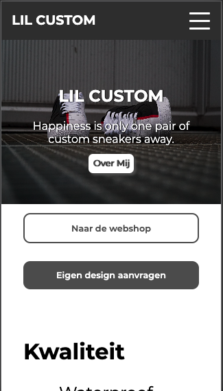
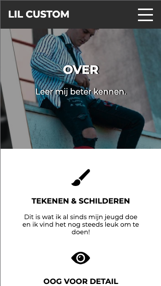

# Procesverslag
**Auteur:** -Sam van der Leek-

Markdown cheat cheet: [Hulp bij het schrijven van Markdown](https://github.com/adam-p/markdown-here/wiki/Markdown-Cheatsheet). Nb. de standaardstructuur en de spartaanse opmaak zijn helemaal prima. Het gaat om de inhoud van je procesverslag. Besteedt de tijd voor pracht en praal aan je website.

## Bronnenlijst
1. https://www.youtube.com/watch?v=At4B7A4GOPg
2. https://css-tricks.com/almanac/
3. https://css-tricks.com/snippets/css/a-guide-to-flexbox/
4. https://css-tricks.com/snippets/css/complete-guide-grid/

## Eindgesprek (week 7/8)

De responsive navigatie maken was nog lastig, dat heb ik ook gemaakt met behulp van een youtube video. De content vormgeven was soms ook lastig maar door css-tricks was het wel goed te doen.

**Screenshot(s):**

## Voortgang 3 (week 6)

Alles was duidelijk en had geen vragen meer. Dit had ik al opgelost door het opzoeken op internet of vragen aan een medestudent.

## Voortgang 2 (week 5)

Helemaal opnieuw begonnen met de website, want de 1e versie was nog onduidelijk voor mezelf.

## Voortgang 1 (week 3)

### Stand van zaken

Alles ging wel goed alleen het toevoegen van een font was nog niet gelukt.

### Agenda voor meeting

-samen met je groepje opstellen-

| Luke de Vries |
|Waarom is ‘stroke’ geen css eigenschap?|
|Bij het drukken op een button herlaad alles ipv de js-actie te ondernemen. |
|Hoe klap ik een ‘uitklapmenu’ uit in animatie?|
|Form heeft geen action. Maar weet niet wat ik moet invullen.|
|Melvin|
|Sam|
|Font die gedownload is gebruiken.|
|Hoe kan ik dit menu uit laten klappen als ik erop klik?|
|Moet je al een grid gebruiken op een small screen of alleen als er een breakpoint komt?|
|Wat betekent de :after en de :before precies? (weet het zelf wel ongeveer)|
|Jimmy|
|De Apple website heeft vaak updates, hoe kan ik dat het beste aanpakken ?|

### Verslag van meeting

Tijdens het gesprek de punten genoteerd, zodat ik deze later kon toepassen.

## Breakdownschets (week 1)

## Intake (week 1)

**Je startniveau:** Blauw

**Je focus:** Responsive

**Je opdracht:** https://lilcustom.com/

**Screenshot(s) van de eerste pagina (small screen):**

**Screenshot(s) van de tweede pagina (small screen):**

